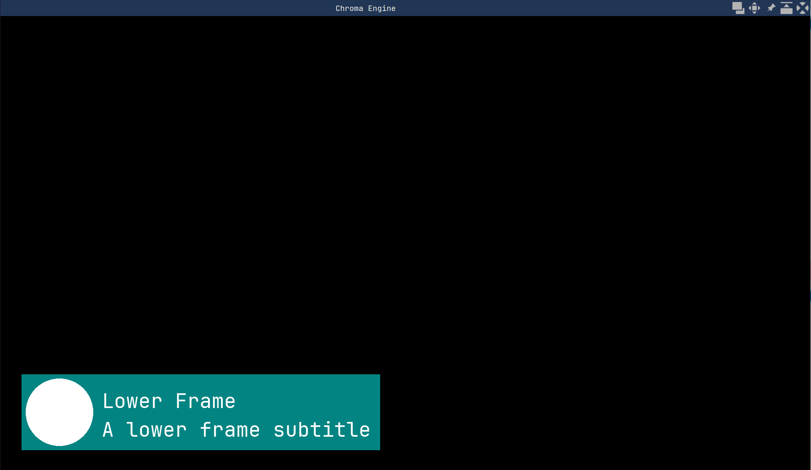
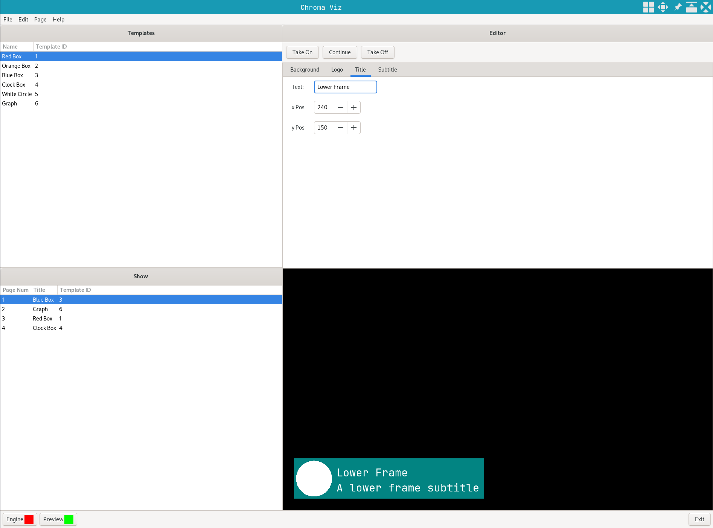

# chroma-engine
Graphics engine for chroma viz built using [GTK][gtk] (v3) and Open GL w/ [GLEW][glew].

## Features

[Chroma Hub][chroma-hub] sends a list of templates to Chroma Engine on startup in order to synchronize templates between Chroma Engine and [Chroma Viz][chroma-viz] instances.
Communicates with [Chroma Viz][chroma-viz] over tcp to render graphics.
Runs as either a standalone window or embedded in [Chroma Viz][chroma-viz] using gtk plug




## Installation

- Install and run [Chroma Hub][chroma-hub]
- Requires a C compiler, `cmake`, `gtk3`, `glew` and `freetype 2`. 
    Current versions: `gtk3 3.24.39`, `glew 2.2.0-6` and `freetype2 2.13.2`.
- Clone the git repo
```
git clone https://github.com/jchilds0/chroma-engine
cd chroma-engine
```
- Update the C Macro `INSTALL_DIR` in `src/chroma-engine.h` to the absolute path of `chroma-engine`
- Build chroma-engine using cmake 
```
cmake -S . -B build/
cmake --build build/
```

## Disclaimer

This is a personal project, not an application intended for production.

[gtk]: https://github.com/GNOME/gtk
[glew]: https://github.com/nigels-com/glew
[chroma-viz]: https://github.com/jchilds0/chroma-viz
[chroma-hub]: https://github.com/jchilds0/chroma-hub
